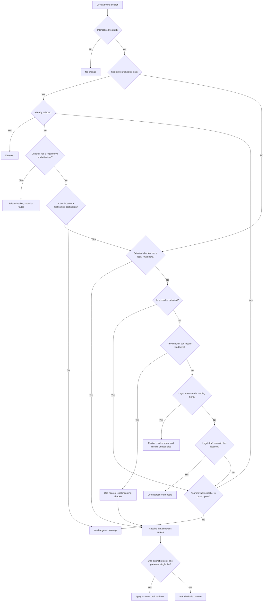

# Point-click decision flow

[Read the illustrated guide on the website](https://mathewseng.github.io/backgammon/controls/).

The shared `DraftBoard` follows this flow in Play and Trainer. Solver uses the same board for noninteractive previews and its separate position editor. The [31-case audit matrix](https://mathewseng.github.io/backgammon/controls/#cases) lists all behavioral categories, with source notes in `INTERACTION-AUDIT.md`. The board tests the pointer against the visible discs, independently of point hit regions. Point numbers and the open area above a stack count as point-space input.

A movable disc click is selection input even if a different selected checker could legally land there. It never auto-plays or auto-undoes that disc. An immovable resident disc does not swallow a highlighted destination: that location still plays the advertised route. Clicking that selected disc again deselects it. Click the point area above a stack to move **onto** it. A point-area click uses an explicitly selected checker when it has a legal route. Otherwise it changes to a movable resident or quietly preserves the selection. With no selection, it brings the nearest legal checker. With no selection and no forward arrival, a legal alternate-die landing revises the draft. Otherwise an amber return target brings back the nearest eligible checker before falling back to resident selection or deselection.

Bar-entry priority and complete-turn legality constrain every route. Selecting another checker cannot bypass the bar. A selected legal route may be a forward move, draft return or alternate-die entry. A checker without a legal forward move, alternate-die revision or draft return cannot be selected; clicking it preserves the existing selection unless its location advertises a legal destination. Dragging remains explicit source → destination input; an invalid drop cancels.

Route resolution deduplicates equivalent outcomes and consumed dice. For combined shortcuts with the same dice, a hitting route beats a quiet one; distinct hitting outcomes remain explicit choices. Different die use may also need a choice. Manual intermediate moves can still avoid a hit. Board returns restore the checker’s entire journey to its pre-roll origin, never an intermediate stop. In a stack, the latest arrival is the checker continued by the next move. Journeys containing a forced prefix cannot return; the separate Undo button can still remove individual chosen steps. Alternate-die revisions can restart a completed chain with the other die while preserving unrelated steps and complete-turn legality.

## Keyboard input

Point keys and focused-point Enter/Space use selection-aware input: pressing the selected point deselects; a legal selected route is played first; otherwise a movable owned point changes selection. An empty destination uses the nearest checker only with no selection. Shift requests point-space destination input explicitly, including for building a point on an occupied location. The existing unambiguous undo-only shortcut remains available to ordinary point keys on an unselected moved checker. Undo and Reset remain directly available. Held keys do not count as repeated presses.

## Repeated clicks and quiet no-ops

There is no double-click timer or special rapid-input mode. Every click uses the current board and selection, regardless of speed. Repeated open-point taps can build a point while that destination remains legal under the current selection. When a forward move completes the draft, its reversible landing stays selected; the next click there deselects instead of unexpectedly using a different checker’s old return route. A following click follows the newly displayed markers.

A timing-based exception was removed because its small point-building benefit did not justify making identical targets behave differently with click speed, automatic selection, or input device. Explicit Shift+point input provides keyboard destination intent without a timing requirement. Unavailable clicks preserve the draft, selection and status text without a message. Invalid drops snap back without an error message.

## Highlight decisions

The [website highlight flowchart](https://mathewseng.github.io/backgammon/controls/#highlights) follows `DraftBoard.render()` and `Board.render()`:

- An enabled live draft supplies legal routes; previews and disabled boards suppress destinations.
- With no selection, `sources()` supplies forward and reversible draft sources, and `availableRoutes()` and legal die revisions supply reachable destinations, including alternative first-die landings after both dice were used. Source discs have dashed rings.
- With a selection, only that checker’s ring and routes are emphasized. Its ring is solid. Routes include forward, draft-return and alternate-first-die revisions.
- Reversible off checkers have a source outline around their tray. Their strips and checker-sized count markers are disc-selection targets; open tray space is destination input.
- Reachable points have a wash/outline. Selected destinations add die/sum or alternate-die labels and a landing ring when stack space permits; OFF is highlighted when reachable.
- Undo targets use the undo palette and a single solid outline at the pre-roll origin. An explicit selected undo route has priority; without selection, forward reachability has priority when both exist. Forced prefixes cannot be undone.
- Hover feedback is limited to actionable live points (or the position editor); unavailable points do not acquire a playable-looking glow.
- Last-turn checkers/ghosts and keyboard focus are independent historical/focus indicators, not legal destinations or recommendations.

Vertical swipes on open board space scroll the page; starting on an actual movable checker reserves the gesture for dragging. Pinch zoom stays available.

The diagram describes ordinary pointer input. Keyboard-only undo is the explicit exception above. A drop is always constrained to the dragged checker; invalid or outside drops cancel. Point-number lanes accept destination clicks and drops.

A roll with more than one legal final position always requires Confirm, regardless of shortcut length or input method. A fresh forward choice can preview its forced continuation; Undo, Reset and reverse moves leave removed choices undone. Only the globally compulsory initial prefix is locked. Fully forced original rolls and passes still advance automatically.
