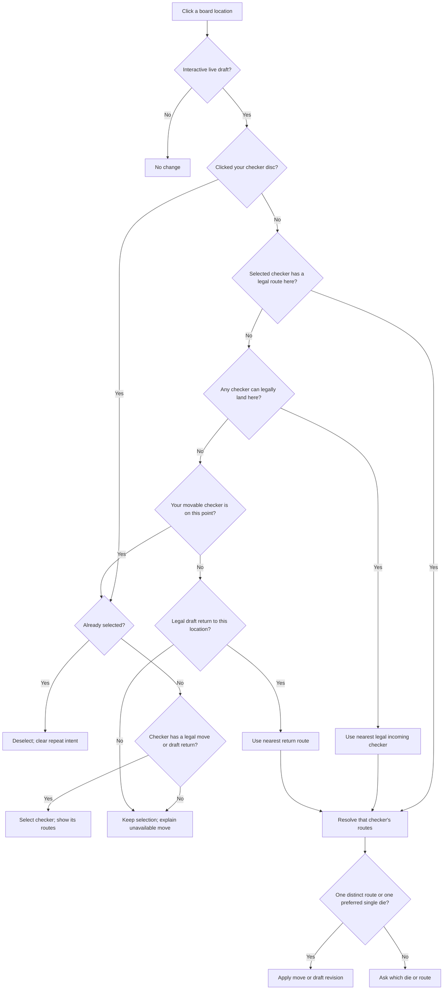

# Point-click decision flow

[Read the illustrated guide on the website](https://mathewseng.github.io/backgammon/controls/).

The shared `DraftBoard` follows this flow in Play, Trainer and Solver. The board tests the pointer against the visible discs, independently of point hit regions. Point numbers and the open area above a stack count as point-space input.

A disc click is selection input even if a different selected checker could legally land there. It never auto-plays or auto-undoes the disc. Clicking that selected disc again deselects it. Click the point area above a stack to move **onto** it. A point-area click uses an explicitly selected checker when it has a legal route; otherwise it brings the nearest legal checker. If nobody can land, it selects the resident checker, or deselects it if already selected.

Bar-entry priority and complete-turn legality constrain every route. Selecting another checker cannot bypass the bar. A selected legal route may be a forward move, draft return or alternate-die entry. A checker without a legal forward move, alternate-die revision or draft return cannot be selected; clicking it preserves the existing selection. Dragging remains explicit source → destination input; an invalid drop cancels.

Route resolution deduplicates equivalent outcomes and consumed dice. For combined shortcuts with the same dice, a hitting route beats a quiet one; distinct hitting outcomes remain explicit choices. Different die use may also need a choice. Manual intermediate moves can still avoid a hit. Draft returns restore dice and cannot cross an automatic forced prefix.

## Keyboard input

Point keys and focused-point Enter/Space use selection-aware input: pressing the selected point deselects; a legal selected route is played first; otherwise an owned point selects and an empty destination uses the nearest checker. Rapid repeated point keys within 350 ms retain destination intent to build a point, and surplus repeats do not reverse the new stack. Shift requests point-space destination input explicitly. The existing unambiguous undo-only shortcut remains available to ordinary point keys on an unselected moved checker. Undo and Reset remain directly available. Explicit disc selection/deselection clears repeat intent. Held keys do not count as repeated presses.
